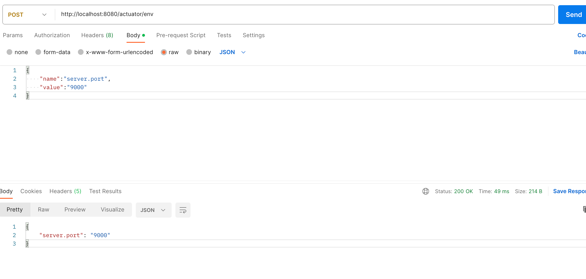
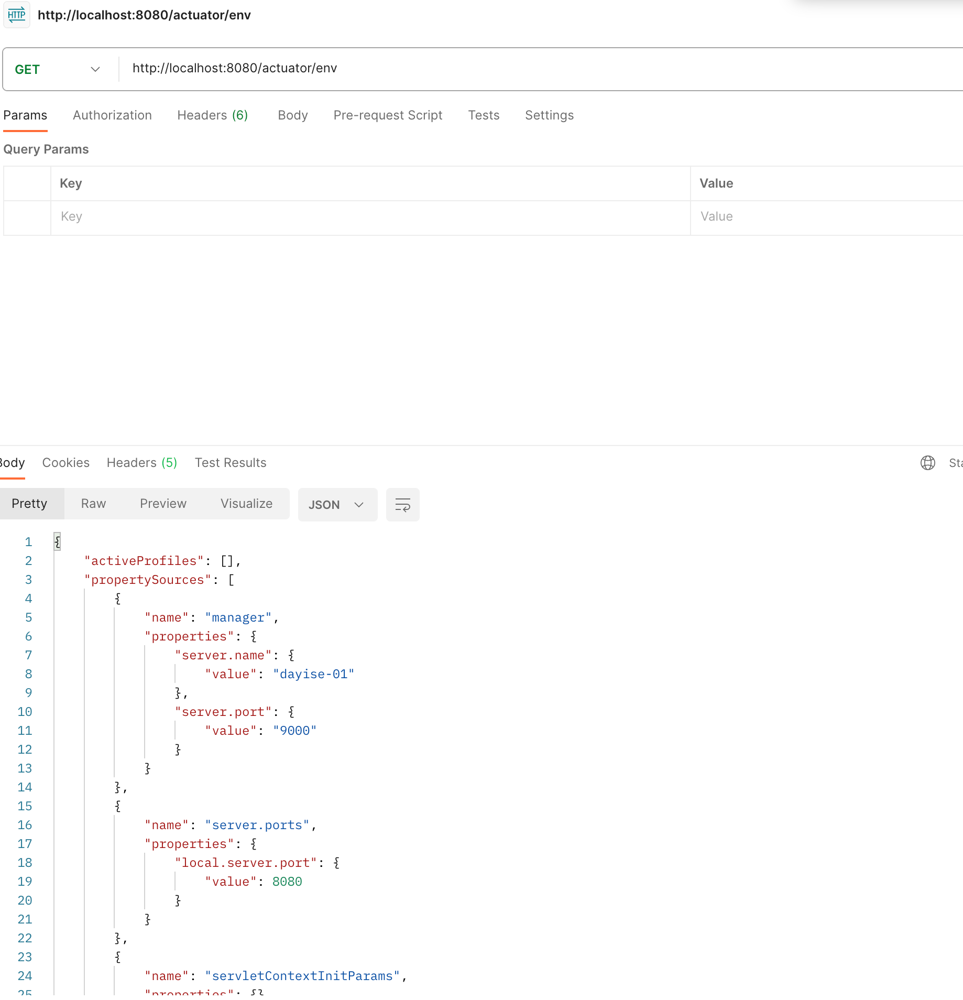

# 基于EnvironmentChangeEvent实现配置动态刷新

## 关键类
 - EnvironmentChangeEvent 
 - ConfigurationPropertiesRebinder 
    通过JMX动态刷新数据environment相关属性的接口
 - WritableEnvironmentEndpointWebExtension
    通过http动态刷新数据environment相关属性的接口，需要引入Spring Boot Actuator相关包
## 相关参考文档
  - Spring cloud context
    [https://docs.spring.io/spring-cloud-commons/docs/3.1.8/reference/html/#endpoints](https://docs.spring.io/spring-cloud-commons/docs/3.1.8/reference/html/#endpoints)
## 运行相关截图
  ### 动态调整server.port
 
 ### 调整后的图片
 