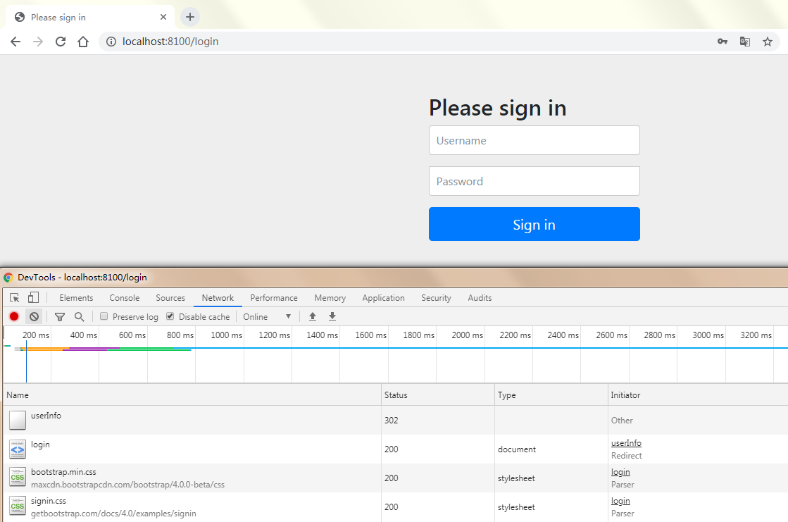
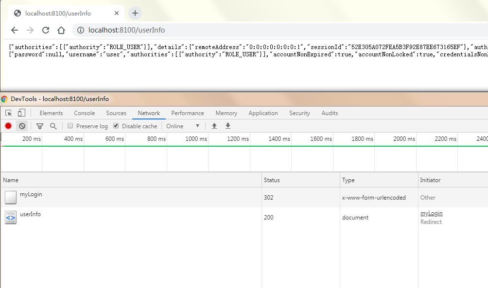
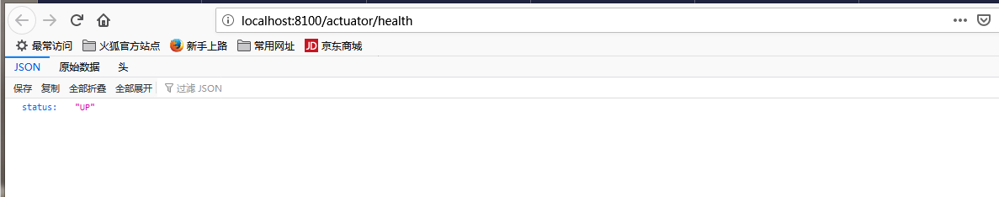
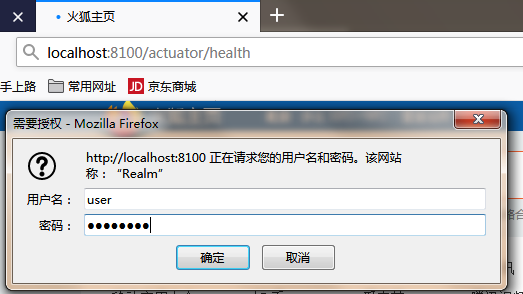

# 项目介绍
通过springboot 实现form表单登录和HttpBasic混合登录,actuator Endpoint 通过Basic认证登录,/hello请求通过form表单登录
## 整合步骤
 - 添加依赖
 ```xml
    <dependencies>
        <dependency>
            <groupId>org.springframework.boot</groupId>
            <artifactId>spring-boot-starter-security</artifactId>
        </dependency>
        <dependency>
            <groupId>org.springframework.boot</groupId>
            <artifactId>spring-boot-starter-web</artifactId>
        </dependency>
        <dependency>
            <groupId>org.springframework.security</groupId>
            <artifactId>spring-security-test</artifactId>
            <scope>test</scope>
        </dependency>
        <dependency>
            <groupId>org.projectlombok</groupId>
            <artifactId>lombok</artifactId>
            <version>${lombok.version}</version>
        </dependency>
        <dependency>
            <groupId>org.springframework.boot</groupId>
            <artifactId>spring-boot-actuator-autoconfigure</artifactId>
        </dependency>
    </dependencies>
```
- 自定义 WebSecurityConfigurerAdapter
```java
/**
 * @author bearBoy80
 * 定义简单的form 表单登录，
 * 默认登录页面为spring security自带页面
 * @see DefaultLoginPageGeneratingFilter#generateLoginPageHtml(HttpServletRequest, boolean, boolean)
 */
@Configuration
public class SecurityFormAuthConfig extends WebSecurityConfigurerAdapter {
    @Override
    protected void configure(HttpSecurity http) throws Exception {
        http.   //关闭crsf
                csrf().disable()
                //拦截所有请求
                .authorizeRequests().anyRequest().authenticated().and()
                //设置表单登录
                .formLogin()
               // .loginPage() 自定义登录页面
                //.failureForwardUrl() 认证失败跳转页面url
                //.successForwardUrl() 认证成功跳转页面url
                //.failureHandler() 认证失败拦截器处理，需要自己实现一个AuthenticationFailureHandler,编写自己的业务逻辑处理，
                // 比如登录失败3次，等几分钟在登录，记录登录失败日志等
                //.successHandler() 认证成功拦截器处理，需要自己实现一个AuthenticationFailureHandler
                // 可以在这里写业务逻辑处理，比如登录成功记录日志、
                //设置登录点
                .loginProcessingUrl("/myLogin");
    }
}

/**
 * @author bearBoy80
 * Actuator Endpoint 增加httpBasic 认证，只有用户角色为ADMIN的才能访问
 */
@Configuration
@Order(10)
public class ActuatorAuthConfig extends WebSecurityConfigurerAdapter {
    @Override
    protected void configure(HttpSecurity http) throws Exception {
        http.requestMatcher(EndpointRequest.toAnyEndpoint()).authorizeRequests((requests) ->
                requests.anyRequest().hasAnyRole("ADMIN", "USER"));
        http.httpBasic();
    }
}
```
- 实现UserDetailsService
```java
/**
 * @author bearBoy80
 * 如果想定制用户认证，需要自己实现 UserDetailService类。本例 通过 InMemoryUserDetailsManager来实现简单表单认证
 * @see UserDetailsServiceAutoConfiguration springboot默认实现
 */
@Configuration
@Log
public class UserDetailServiceConfig {

    @Bean
    public UserDetailsService users() {
        UserDetails user = User.builder()
                .username("user")
                .password("{bcrypt}$2a$10$GRLdNijSQMUvl/au9ofL.eDwmoohzzS7.rmNSJZ.0FxO/BTk76klW")
                .roles("USER")
                .build();
        UserDetails admin = User.builder()
                .username("admin")
                .password("{bcrypt}$2a$10$GRLdNijSQMUvl/au9ofL.eDwmoohzzS7.rmNSJZ.0FxO/BTk76klW")
                .roles("USER", "ADMIN")
                .build();
        return new InMemoryUserDetailsManager(user, admin);
    }
}
```
- 增加UserDetailController
```java
/**
 * @author bearBoy
 * 获取用户认证信息
 */
@RestController
public class UserDetailController {
    @RequestMapping("/userInfo")
    public User userInfo(@AuthenticationPrincipal User user) {
        return user;
    }

    @RequestMapping("/hello")
    public String hello() {
        return "hello Word Spring Security";
    }
}
```
- 配置actuator 
```yaml
server:
  port: 8100
spring:
  jmx:
    enabled: true  #开启jmx
  application:
    name: ActuatorAuthApplication
#开启jmx,web actuator 端点暴露
management:
  endpoints:
    jmx:
      exposure:
        include: "*"
    web:
      exposure:
        include: "*"
        exclude: shutdown
logging:
  level:
    org.springframework : info
```
- 启动应用
 运行ActuatorAuthApplication
- 验证form表单认证
  请求http://localhost:8100/userInfo,页面跳转到登录页面，输入user/password账户密码登录，登录成功后获取到凭证信息
  
 
 

- 验证basic认证
  请求http://localhost:8100/actuator/health 弹出basic认证框,输入user/password账户密码登录
  



 ## 部署应用到docker
 - 添加docker maven 插件 [fabric8](https://maven.fabric8.io/)
 ```xml
 <plugin>
                     <groupId>io.fabric8</groupId>
                     <artifactId>docker-maven-plugin</artifactId>
                     <version>0.33.0</version>
                     <extensions>true</extensions>
                     <configuration>
                         <verbose>true</verbose>
                         <dockerHost>docker容器IP:2375</dockerHost>
                         <images>
                             <image>
                                 <name>${project.artifactId}</name>
                                 <build>
                                     <dockerFileDir>
                                         ${project.basedir}
                                     </dockerFileDir>
                                 </build>
                             </image>
                         </images>
                     </configuration>
                     <executions>
                         <execution>
                             <id>build</id>
                             <phase>post-integration-test</phase>
                             <goals>
                                 <goal>build</goal>
                             </goals>
                         </execution>
                     </executions>
                 </plugin>
 ```
 - 添加dockerfile文件
 ```text
 # 基于java:8-jdk-alpine 镜像进行创建
 FROM java:8-jdk-alpine
 #维护人
 MAINTAINER bearBoy80
 #复制jar到/usr/app目录
 COPY ./target/spring-actuator-auth-0.0.1-SNAPSHOT.jar /usr/app/
 #指定镜像工作目录
 WORKDIR /usr/app
 #更新jar包信息
 RUN sh -c 'touch spring-actuator-auth-0.0.1-SNAPSHOT.jar'
 #暴露8010端口，实际运行镜像需要指定宿主端口 -P或者-p
 EXPOSE 8010
 #启动容器后启动spring-actuator-auth-0.0.1-SNAPSHOT.jar的应用
 ENTRYPOINT ["java", "-jar", "spring-actuator-auth-0.0.1-SNAPSHOT.jar"]
 ```
 - 生成镜像
 ```shell
 mvn package fabric8:build
 ```
 - 部署镜像到容器
 ```shell
 docker run -d 镜像id -P
 ```
 